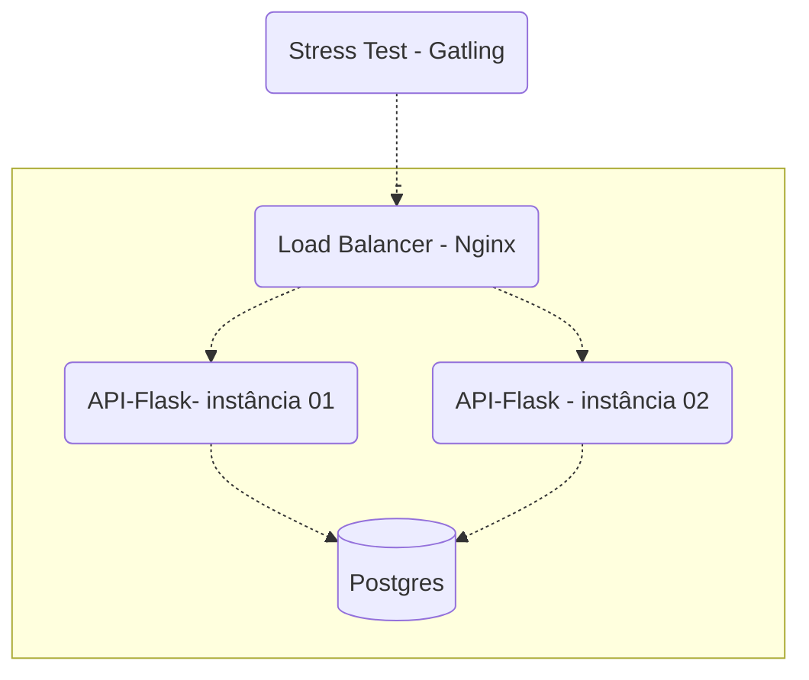

# Projeto [Rinha de Backend 2023](https://github.com/zanfranceschi/rinha-de-backend-2023-q3) feito em python 
### Para mais informações acesse as [instruções](https://github.com/zanfranceschi/rinha-de-backend-2023-q3/blob/main/INSTRUCOES.md)
## Tecnologias usadas: 
  - Flask (framework python)
  - pydantic v2 (serialização e desserialização)
  - Postgres (banco de dados relacional)
  - Nginx (balanceador de carga)
  - sqlalchemy (ORM para integração com banco de dados)
### Passos para Instalar

1. **Clone o repositório:**
    ```bash
    git clone https://github.com/Deivison07/rinha-back-end-2023.git
    ```
## Executando a Aplicação

1. **Navegue até o diretório do projeto:**
    ```bash
    cd rinha-back-end-2023
    ```
2. **Construa e execute a aplicação usando Docker Compose:**
    ```bash
    docker-compose up --build
    ```

## fluxo de trabalho



