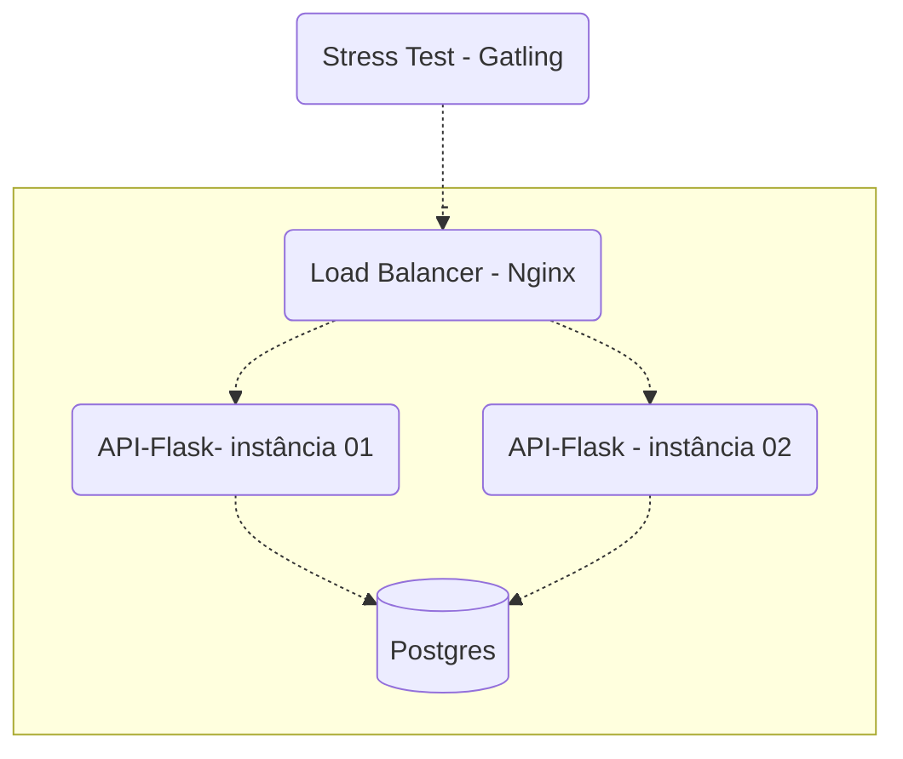

# Projeto [Rinha de Backend 2023](https://github.com/zanfranceschi/rinha-de-backend-2023-q3) feito em python 
### Para mais informações acesse as [instruções](https://github.com/zanfranceschi/rinha-de-backend-2023-q3/blob/main/INSTRUCOES.md)
## Tecnologias usadas: 
  - Flask (framework python)
  - Pydantic (serialização e desserialização)
  - Postgres (banco de dados relacional)
  - Nginx (balanceador de carga)
  - sqlalchemy (ORM para integração com banco de dados)

## fluxo de trabalho

